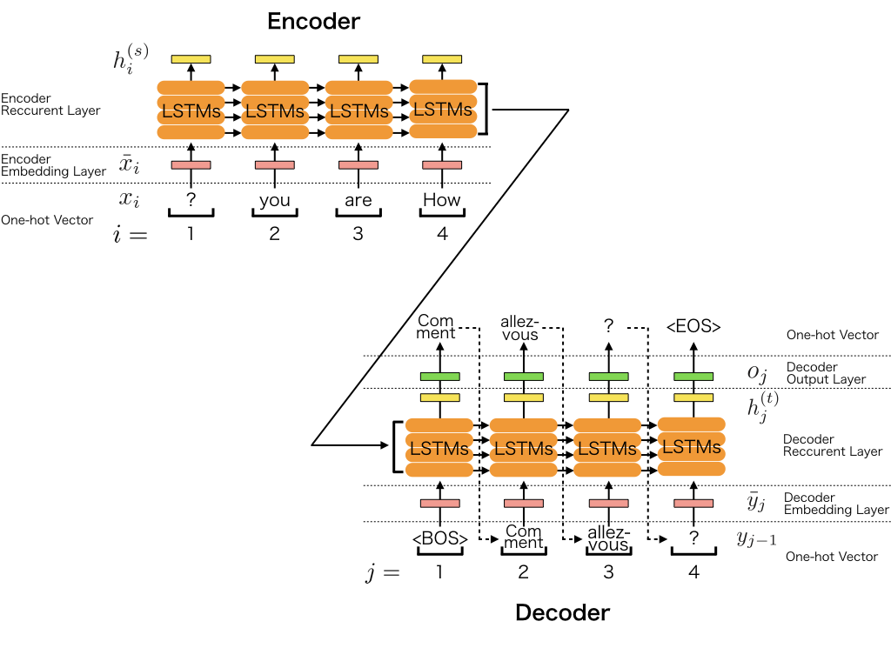
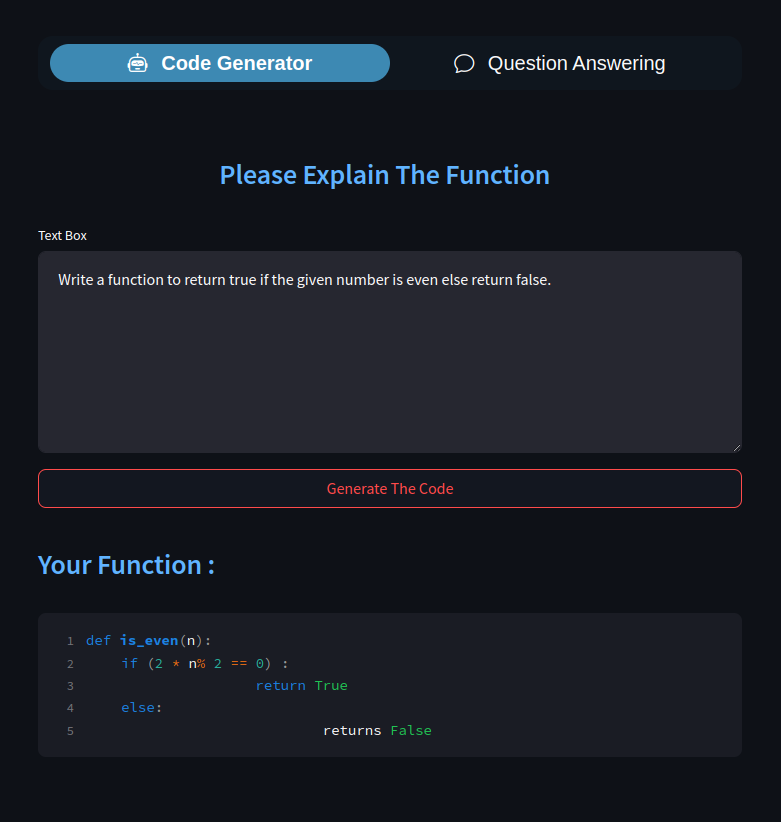

# Problem-Solver
In This Project :

 - You Can **Generate** The **Code** By Explaining What You Want
 - You Can **Asking** any **Question** From any **Website** And You Will Have The **Answer**

## Code Generator
 - Finetune **CodeT5** on **MBPP** Dataset with **TensorFlow** 
 - **T5** architecture employs denoising **sequence-to-sequence** **(Seq2Seq)** pre-training and has been shown to benefit out-of-the-box for both understanding and  generation tasks in **natural language**.

#### More Information About [Seq2Seq](https://docs.chainer.org/en/v7.8.0/examples/seq2seq.html) And [codeT5](https://paperswithcode.com/method/codet5)

 
   
   

### Setup Strategy [Code](./SetupStrategy.py)
 - Setup Mixed **Precision Training**
 - Setup **XLA** Optimizing **Compiler** for Machine Learning
 - Setup **Distribution** Strategy
 - Disable **FP16**

### Mostly Basic Python Problems Dataset
 - It contains 974 short Python functions designed to be solved by entry-level programmers
#### You Can Fine The Dataset [here](https://www.kaggle.com/code/rhtsingh/text-to-code-generation-with-tensorflow-mbpp)

### Dataset Processing [Code](./DatasetProcessing.py)
 - Data Downloading to **Processing** and **Converting** to **TensorFlow**
 - **Optimize** data **Pipeline** [more information](https://www.tensorflow.org/guide/data_performance) 
 - Download data using a **Keras** utility
 - Encode text-code pairs
 - Encode texts by prepending the task for input **sequence**
 - Replace the index of the padding **tokens by -100**
 - turn off auto-sharding
 - distribute dataset to devices

### Utility Functions [Code](./UtilityFunctions.py)
 - fix_all_seeds() sets the random seed for deterministic results
 - init_logger() initialize logger for tracking events
 - ProgressBar() custom progress bar to display metrics

### Custom Training Loop [Code](./CustomTrainingLoop.py)
 - Define Trainer class for **Training** and **Evaluation** loop
 - Iterate each epoch An epoch is one pass through the dataset
 - Within an epoch, iterate over each example in the training Dataset grabbing its features (x) and label (y)
 - Use an optimizer to update the model's parameters.
 - Keep track of some stats for logging.
 - Repeat for each epoch.

### [Run](./Run.py) And [Execute](./mainlauncher.py)
- The run() function defines our execution process. We download, load and preprocess and convert our data into tf.data.Dataset format
- We create instance of our Trainer and pass everything to .train() method for running our custom training loop.
- In the end we save our model and tokenizer using .save_pretrained() method.
- Define our training arguments **model, data, optimizer, training and initialize directories**.
> **Warning :**
> Do Not Run it on **CPU** it's will Take So Much Time And Also after Training Model when you want to Run and Test The Program With Predict file 
> Do Not Run it on **CPU** Performance Will be Low!

### Predict [Code](./streamlit/Predict.py)
 - Generate our code in **predict_from_dataset()** but one can call **predict_from_text()** and provide **custom input**.

  
  
  Testing Our Code Generator with Streamlit 
 
 
   
   

#### The results aren't as amazing but that's because the model is t5-base and because the fine-tuning set is extremely small. and also Dataset it's not that much great, Sometimes you will get the bad answer like this :

  
  
 
   
   

> **Warning**
> I,M here To Just Say Again Do Not Run it on **CPU** you Will Get Wrong **Answers** !